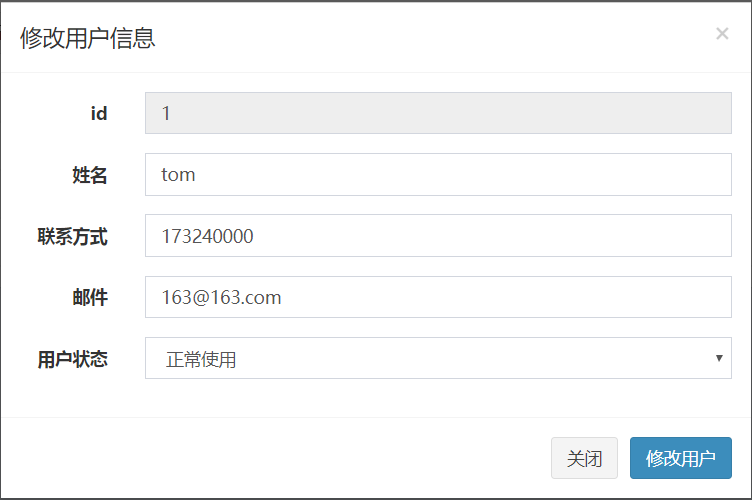

# 化妆店商品采购管理系统

​	化妆店为提高采购效率，管理人员信息，开发化妆店商品采购管理系统。基于Springboot框架设计该系统。

​	化妆店商品采购管理系统由主管来管理，下面由4个部门组成，分别为人事部门，销售部门，采购部门，物流部门。而部门所涉及的功能为4个大的功能模块：登录模块，信息查询模块，信息维护模块，密码修改模块。而信息查询模块和信息维护模块中又分为10个子模块（用户，权限，员工权限，个人，顾客，产品，订单，订单意见，采购，物流）来进行功能细分。

## 1.登录界面

## 2.主界面

## 3.侧边栏

## 4.用户界面

#### 新建拟态框

#### 修改拟态框

#### 管理员修改密码拟态框

## 5.权限界面

#### 修改拟态框

## 6.员工界面

#### 新建拟态框

#### 修改拟态框

## 7.个人界面

#### 修改拟态框

#### 个人修改密码拟态框

## 8.顾客界面

#### 新建拟态框

#### 修改拟态框

## 9.产品界面

#### 新建拟态框

#### 修改拟态框

## 10.产品详细页面

#### 修改拟态框

## 11.订单界面

#### 新建拟态框

#### 修改拟态框

## 12.订单意见界面

#### 新建拟态框

#### 修改拟态框

## 13.采购界面

#### 新建拟态框

#### 修改拟态框

## 14.物流界面

#### 新建拟态框

#### 修改拟态框

